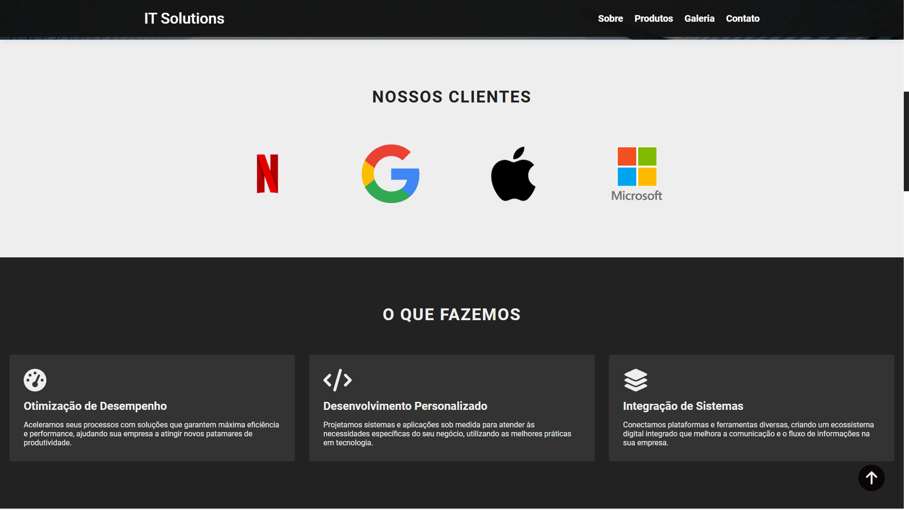
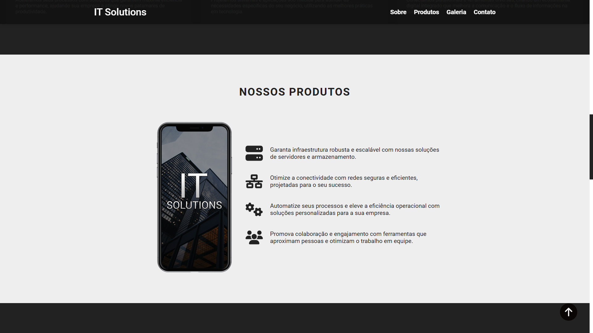
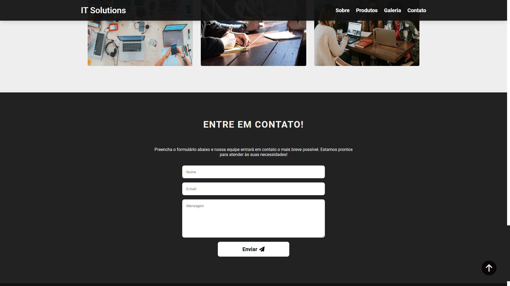

<div align="center"> <h1>IT Solutions</h1> </div>

<p align="center">Inovação e tecnologia para transformar negócios.</p>

<p align="center">
  
  
  
</p>

## 📝 Sobre o projeto

Landing page desenvolvida para a IT Solutions, focada em destacar serviços e soluções tecnológicas que ajudam empresas e profissionais a otimizar processos, alcançar novos patamares de desempenho e se manterem competitivos no mercado.

## 🛠 Tecnologias utilizadas

-   **React.js** - Biblioteca JavaScript para construção de interfaces
-   **Vite** - Ferramenta de build rápida para desenvolvimento front-end
-   **TypeScript** - Extensão do JavaScript que adiciona tipos estáticos para maior segurança
-   **JavaScript** - Linguagem de programação para desenvolvimento web
-   **HTML** - Linguagem de marcação que estrutura o conteúdo na web
-   **CSS** - Linguagem de estilos usada para definir o visual das interfaces web
-   **Styled Components** - Biblioteca para estilização baseada em componentes no React

## 📸 Screenshots

<p align="center">
  
</p>

<p align="center">
  
</p>

<p align="center">
  
</p>

<p align="center">
  
</p>

## 🌐 Acesse o projeto online
Você pode acessar a versão online do projeto [aqui](https://it-solutions-ma.vercel.app/).

## 🖥️ Como configurar o projeto

Siga os passos abaixo para instalar e executar o projeto em seu ambiente local:

### 1. Clone o repositório:

```bash
$ git clone https://github.com/mauricio071/it-solutions
```

### 2. Acesse o diretório do projeto:

```bash
$ cd it-solutions
```

### 3. Instale as dependências necessárias:

```bash
$ npm install
```
ou

```bash
$ yarn
```

### 4. Inicialize o projeto:

```bash 
$ npm run dev
```
ou

```bash 
$ yarn dev
```
Agora você pode acessar o projeto no navegador em http://localhost:5173 (ou na porta indicada pelo terminal).
